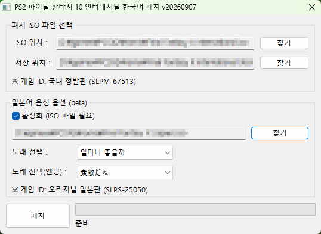
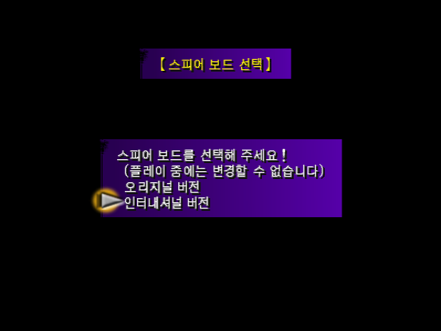
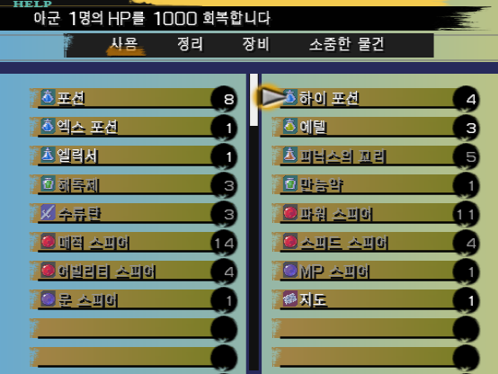
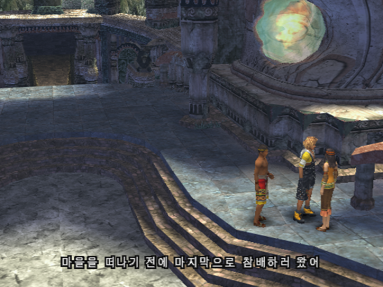

# ffx-international-kr

PS2용 **파이널 판타지 10 인터내셔널** 한국어 비공식 번역 프로젝트입니다.

## 패치 정보

* 대상 게임: PS2 파이널 판타지 10 인터내셔널 (게임 id: `SLPM-67513`)
* 번역 기준: 일본어 원문
* 사용 글꼴: 돋움체(텍스트), Noto Sans(그래픽)

## 미리보기

## 패치 버전

* **기본 버전**: 영문 음성 + 한국어 또는 영어 자막 선택
* **일본어 음성 버전 (실험 버전)**: 한국어 자막 + 일본어 음성

## 사용 전 확인

* 패치 대상은 위 게임 ID에 해당하는 **수정하지 않은 원본 ISO**입니다. 다른 지역판이나 이미 패치한 ISO에는 적용하지 마세요.
* 번역 오류나 게임 진행 중 문제가 남아 있을 수 있습니다. 문제를 제보할 때는 사용한 패치 버전, 발생 장소와 상황, 해당 대사나 스크린샷을 함께 알려주시면 확인에 도움이 됩니다.
* 원본롬에서 생성된 세이브 파일의 호환을 보장하지 않습니다. 되도록 새로운 게임으로 플레이하시기를 권장합니다.

## 안내 및 면책

* 이 패치는 팬이 제작한 비공식 패치이며, 원작의 제작사·유통사와 관계가 없습니다. 원작의 저작권과 상표권은 각 권리자에게 있습니다.
* 원본 게임이나 패치가 적용된 게임 ISO는 제공하지 않습니다. 본인이 정당하게 보유한 게임으로 이용해 주세요.
* 패치는 현재 상태 그대로 제공되며, 모든 환경에서의 정상 작동이나 세이브 호환성을 보장하지 않습니다.
* 적용 및 사용 여부는 사용자가 판단해 주세요. 법령이 허용하는 범위에서, 제작자는 패치 사용으로 발생한 데이터 손실 등의 손해에 책임을 지지 않습니다.

## 번역 및 제작에 사용한 도구

### 번역

* [OpenAI Codex](https://chatgpt.com/): 이벤트 대사 초벌 번역
* [바른 한글](https://nara-speller.co.kr/speller): 맞춤법·띄어쓰기 확인
* [구글 번역](https://translate.google.com/): 번역 참고
* [NAVER 사전](https://dict.naver.com/): 단어와 표현 확인

### 도구

* [Ghidra](https://github.com/NationalSecurityAgency/ghidra), [ghidra-emotionengine](https://github.com/chaoticgd/ghidra-emotionengine-reloaded): 프로그램 분석
* [OpenAI Codex](https://chatgpt.com/): 프로그램 분석, 코드 작성
* [armips](https://github.com/Kingcom/armips): 어셈블리 코드 패치
* [xdelta](https://github.com/jmacd/xdelta): 패치 파일 생성
* [RK-Translations](https://www.rk-translations.cz): 체코어 번역 프로젝트에서 공개한 [텍스트·그래픽 도구](https://www.romhacking.net/utilities/1390)
